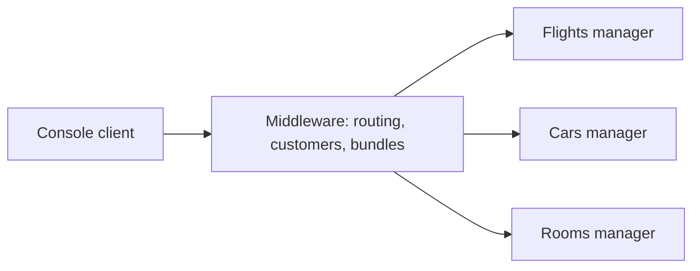

# COMP512 PA1: requirements, code map, and implementation plan

Analysis date: October 3, 2026. Status: planning complete; implementation has not started.
The starter code is preserved in baseline commit `3021762`.

## Scope and source documents

This work covers implementation, automated tests, source annotations, incremental local
Git commits, technical change documentation, and executable demo scenarios. The individual
report and meeting records are owned by the user and are excluded from implementation work.

Sources: `COMP512-p1-2026.pdf` (5 pages), `GettingStarted.pdf` (3 pages), and
`clientUserGuide.pdf` (2 pages). All pages were extracted and visually reviewed.
`AI-logging-examples/` contains conversation export examples, not application code.
The JSON example contains `responderUsername`, `initialLocation`, and `requests`.

## Required behavior and procedures

| Requirement | Implementation acceptance condition | Source |
| --- | --- | --- |
| Flights, cars, rooms | Separate inventory managers; flight number or location identifies an item | Assignment p1-2 |
| Duplicate additions | Increment count; change an existing item's price only when the supplied price is positive | Assignment p1 |
| Customer reservations | Maintain each customer's reservation list; bill lists items and total cost | Assignment p1 |
| Customer deletion | Cancel every reservation and return quantities to the owning managers | Assignment p1 |
| Reserved inventory deletion | Reject deletion while reservations exist | Client guide p1 |
| RMI distribution, 25 points | Existing client calls middleware through the same interface; middleware routes to three managers | Assignment p2 |
| Customer ownership | Choose middleware, replicated managers, or a separate customer server | Assignment p2 |
| Bundle | Reserve one or more flights and optionally a car and room at the destination | Assignment p2, client guide p2 |
| TCP distribution, 50 points | TCP on both client-to-middleware and middleware-to-manager links; same distributed topology | Assignment p3 |
| TCP concurrency | Waiting for one manager must not stop middleware accepting/servicing unrelated requests; managers handle concurrent requests | Assignment p3 |
| General TCP wrapping | AI-assisted solution must use shared message creation for all or nearly all client operations | Assignment p3 |
| Demo, 10 points | At least five distinct machines: client, middleware, Flights, Cars, Rooms; working commands and concurrency examples | Assignment p5 |
| Submission | All code on MyCourses by the demo; preserve the alternate preliminary RMI version separately | Assignment p3,5 |

The handout specifies an October 5 report deadline and demos during the following three
days; actual assigned demo slot is not present here. Implementation priority is therefore
working RMI, working concurrent TCP, then demo hardening. These dates come from the supplied
handout, not a live schedule check.

Procedural requirements to retain while leaving report/meetings to the user: the initial
RMI comparison uses independently developed AI and non-AI versions, and both preliminary
versions must be preserved. This workspace is the AI-assisted version. Complete AI sessions
must be retained/exported; a changelog is not a replacement for that export. Do not invent
the teammate's independent version, meeting history, contributions, or token usage.

## Directory and CodeGraph map

CodeGraph was explicitly initialized at the user's request. The CLI indexed 15 Java files,
241 nodes, and 540 edges. No CodeGraph MCP tool is exposed in this session, so the installed
`codegraph` CLI provides the same exploration and source-reading operations.
The local `.codegraph/` database is ignored by Git.

| Area | Existing responsibilities | Planned changes |
| --- | --- | --- |
| `Template/Client/Client/Client.java` | Console parser and switch dispatch through `IResourceManager` | Preserve RMI-facing behavior; repair startup blocker; reuse console for TCP |
| `Template/Client/Client/Command.java` | Command descriptions and names | Reconcile bundle flag help with accepted values |
| `Template/Client/Client/RMIClient.java` | Registry lookup and reconnect | Point to middleware using existing host/name arguments |
| `Template/Server/Server/Interface/IResourceManager.java` | 21 remote method signatures, including overloaded customer creation | Keep client contract compatible |
| `Template/Server/Server/Common/ResourceManager.java` | In-memory inventory, customer CRUD, reservation operations | Make complete operations atomic; separate backend inventory operations from customer coordination |
| `Template/Server/Server/Common/Customer.java` | Customer reservation map, latest-price aggregation, formatted bill | Middleware ownership; add bill total |
| Other `Common` classes | Item models, keys, clone support, diagnostics | Reuse; annotate changes where needed |
| `Template/Server/Server/RMI/RMIResourceManager.java` | Export a manager and bind its registry name | Keep manager host; add middleware RMI entry point |
| Makefiles and launch scripts | Compile starter and launch hosts | Add middleware/TCP targets and explicit endpoint configuration |

Existing call path: `RMIClient.main -> connectServer -> Client.start -> parse/execute ->
IResourceManager -> ResourceManager -> readData/writeData`. Reservations use `reserveItem`;
customer deletion currently restores inventory only within the same manager's map.
`RMHashMap.clone` clones each entry, and `Customer.clone` clones its reservation map.

## Verified starter gaps and risks

1. **Full build fails:** `Client.java:380` contains U+0003 inside `elementAt(1...)`.
   Java 17 reports an illegal character. Preserve the original in Git and repair this as
   an explicitly documented starter fix, not an architectural client rewrite.
2. **Server-only build succeeds:** all server Java sources compile with Java 17.0.11.
3. **No middleware:** `run_middleware.sh` only prints instructions; `run_servers.sh`
   has an empty host list. There is no TCP implementation or automated test suite.
4. **Bundle is unimplemented:** `ResourceManager.bundle` returns false unconditionally.
5. **Bills omit the total:** `Customer.getBill` prints quantities and unit prices only.
6. **Operations are not atomic:** separate synchronized reads and writes allow two
   concurrent reservations to read the same inventory/customer snapshots. The same
   issue affects add, delete, and generated customer IDs.
7. **Generated IDs can collide:** random/time concatenation does not check existing IDs.
8. **Bundle flag mismatch:** the guide says 0/1; command help says Y/N; the implementation
   accepts only the Boolean parser's true/false semantics. During RMI compatibility work,
   retain the console contract and use true/false in scenarios; isolate any correction to
   support the documented flags and clearly record that starter compatibility fix.
9. **Deployment assumptions:** hard-coded `group_xx_` and registry port 1099 require a
   consistent unique binding name and available ports. Exported RMI objects use an ephemeral
   port; cross-machine advertisement/firewall behavior must be checked on the demo hosts.
10. **Billing price semantics:** repeated bookings of one item replace the stored unit
    price for that customer's entire grouped reservation. Preserve this explicit starter
    convention initially and document it; do not silently introduce historical pricing.
11. **Client retry behavior:** the console retries after an RMI connection exception.
    Do not add automatic TCP mutation retries after an ambiguous timeout.

## Proposed architecture

Both transports use the same topology:

Keep customers and their reservation ledger at middleware. This avoids customer replication
and makes combined bills straightforward. Backend managers own their inventory and reservation
counts. Add a separate internal inventory interface for atomic reserve/release operations,
including the booked price in the reserve result. The existing client interface remains intact;
the same internal operations can be carried over RMI and TCP. Calling the existing reserve
method unchanged would fail because it expects a customer in the backend's local map.

Use atomic backend state transitions under short locks, and serialize conflicting middleware
operations per customer. Locks must cover the relevant read-modify-write, not just map access.
Avoid a middleware-wide lock held across network calls. TCP coordination should use asynchronous
per-customer queues so one waiting customer does not consume all workers. Inventory locks never
wait for remote calls. Start with simple per-manager state locking and refine only if tests
show contention prevents independent progress; concurrent connection/request handling remains
separate from the brief serialization of state mutations.

For bundles, validate inputs, count repeated flight numbers, obtain reservations sequentially
or through controlled async composition, and record successful acquisitions. On an ordinary
unavailable-item failure, release only this bundle's acquisitions; retain pre-existing customer
reservations. Publish customer ledger additions after all acquisitions succeed. Prechecking
counts is an optimization, never the correctness mechanism. Proposed behavior is all-or-nothing
for ordinary failures while all servers remain reachable; the handout does not explicitly demand
distributed transactions. Compensation does not provide isolation from concurrent queries or
crash-safe atomicity. A network failure after mutation can leave an uncertain outcome; report
that accurately instead of claiming rollback always succeeded. Use operation receipts/identifiers
if needed to make reserve/release reconciliation idempotent without promising durable recovery.

Customer deletion releases quantities to each owning manager and removes the customer only
after completion. Track confirmed releases to avoid releasing them twice if an operation is
resumed. Competing reservations for that customer remain serialized during deletion.

For TCP, use a shared typed, length-prefixed request/response envelope containing protocol
version, request ID, operation/signature, typed arguments, and result/error. A bounded binary
codec using Java data streams avoids external JSON dependencies and RMI on either TCP link.
Operation identity distinguishes `newCustomer()` from `newCustomer(int)`. Bills and location
strings must survive framing without delimiter tricks. One common invocation method and
validated dispatcher handle every interface operation; adapters supply arguments, not custom
message layouts per method.

Use persistent backend channels, a pending-request map keyed by request ID, a reader that
completes futures, and one serialized writer per connection. Response IDs route out-of-order
completions to the correct client. Middleware composes futures and sends responses when they
complete; its accept/read loops never wait for a manager reply. Separate bounded request
execution from channel reading/writing to prevent worker starvation. Managers accept multiple
connections and dispatch concurrent requests. Include timeouts, frame bounds, explicit errors,
disconnect cleanup, pending-map cleanup, and orderly shutdown. The console client may block
while awaiting its own response, as permitted by the assignment.

## Stages, tests, and commits

These are planned stages, not completed features. Choose small vertical TDD slices within each:
one failing behavioral test, minimal implementation, passing test, then the next behavior.

| Stage | Deliverable | Representative behavioral verification | Intended commit |
| --- | --- | --- | --- |
| 0 (done) | Inspect documents/code, initialize Git and CodeGraph, preserve starter | Server compiles; record full-build failure | `chore: preserve assignment handouts and untouched starter code` plus planning docs |
| 1 | Runnable starter and test runner | Build/launch; duplicate additions; reservation rejection; bill total; generated-ID uniqueness | `fix: repair starter build and establish behavior tests` |
| 2 | Atomic inventory reserve/release service | Two callers compete for last seat: one succeeds; release restores exactly the acquired quantity | `feat: add atomic inventory reservation operations` |
| 3 | RMI middleware and customer lifecycle | Unchanged console reaches middleware; correct RM routing; combined bill; deletion restores all types | `feat: distribute reservations through RMI middleware` |
| 4 | Bundle coordination | Flights-only and optional car/room; duplicate flights; sold-out later item undoes earlier acquisitions | `feat: coordinate bundles with compensation` |
| 5 | General TCP codec and invocation | Every signature round-trips; both customer overloads; Unicode/multiline bill; malformed, split, and joined frames | `feat: add shared TCP request and response protocol` |
| 6 | Concurrent TCP endpoints | Actual TCP on both links; slow Flights response does not delay another client's Cars query; out-of-order replies routed correctly | `feat: add concurrent TCP client middleware and managers` |
| 7 | Multi-host deployment and demo scripts | Both modes, all commands, concurrency, disconnects, clean restart and five-host walkthrough | `chore: add deployment scripts and acceptance scenarios` |

Test boundary proposal, to confirm before writing tests under the TDD skill:

- Public `IResourceManager` behavior: local service, RMI endpoint, and TCP adapter.
- Public internal inventory reserve/release contract.
- Public protocol encode/decode and invocation boundary.
- Real running endpoints and console inputs for integration/concurrency/deployment tests.

Tests must observe public results, bills, and availability, never private maps or private
helpers. Use real in-process managers for service tests, real loopback sockets for transport
tests, and controlled backend delays plus latches/barriers for concurrency. Avoid sleep-based
race assertions. The decisive nonblocking test starts a delayed Flights request, then proves
an unrelated Cars query completes before Flights is released. Add backend concurrency and
contention tests, pending-request disconnect completion, invalid method/signature handling,
and no duplicate effects from any intentional retry.

Use a lightweight Java test runner or JUnit if a dependency is readily available on demo
machines; avoid making offline lab execution depend on downloading build tools. Run relevant
tests at each slice and the full transport acceptance suite before a stage commit. Keep RMI
and TCP behavior aligned through shared contract scenarios.

## Documentation and deployment deliverables

- `docs/CHANGELOG.md`: implemented changes, new features, tests, and limitations per stage.
- This plan: update as architectural choices are resolved.
- Later `docs/TESTING.md`: commands, actual test results, and requirement mapping.
- Later `docs/RUNNING.md`: RMI/TCP startup/shutdown, endpoint arguments, local versus five-host execution.
- Concise source comments explain stage, invariant, and concurrency/protocol intent where
  behavior is introduced. Git retains chronology; comments should not repeat obvious code.
- Preserve/export actual AI interactions independently of these technical documents.
- No report, meeting record, contribution narrative, presentation deck, or fabricated logs.

Unresolved deployment inputs: group identifier, available registry/TCP ports, five lab hostnames,
and the exact assigned demo slot. These do not prevent local implementation. The next concrete
implementation stage is starter repair and test setup after confirming the proposed test boundaries.
